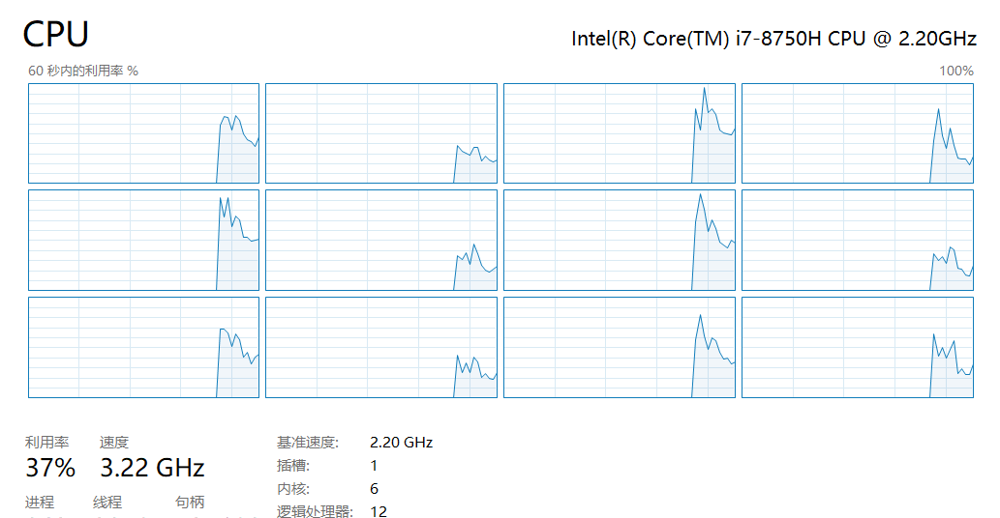

# Mapbox 瓦片下载

> 当前使用版本 Python 3.8
> 依赖：requests=2.28.1   (理论上低版本应该也可行)
> 可下载 Mapbox 瓦片地图，也可以下载高程地图，只需要修改名称即可。

## 需要修改的配置

所有配置均放在 `config.py` 中。

- `filename`: 修改保存的文件路径，默认在当前目录 `{pat}/{filename}/{z}/{x}/{y}.png` 下。
- `zoom` 下载的瓦片层级（懒得写范围了，1到9层每层手动运行一次也不是多大的事）
- `token` mapbox token，用官网的扒下来的 token 居然可以正常下载 emmmm
- `max_workers` 线程池大小，看电脑和网线的吧……我的 6C12线程的设置 96 就跑不满 96。

## 执行

```commandline
python main.py
```

## 数据

下载第 8 层大约需要 20 分钟。（24线程）
下载第 9 层大约需要 60 分钟。（96线程）

目前已知的数据量 (TerrainRGB)

```
32K     ./0
120K    ./1
432K    ./2
1.7M    ./3
6.0M    ./4
22M     ./5
191M    ./6
672M    ./7
2.21G     ./8
（预计）8GB     ./9
```

# Profile

性能情况：CPU 30% 占用。瓶颈其实应该还是在带宽上。每秒平均50个就撑死了。




后续可能要做的：

- 已下载文件的检查功能（毕竟文件多了以后就要考虑“断点续传”，断开的下载恢复。目前如果重新下载只能保证不重新下载。后续考虑通过判断文件夹个数的方式进行操作。但是还要考虑有的地方可能是没有数据导致的数据不满，这个真没办法23333）
